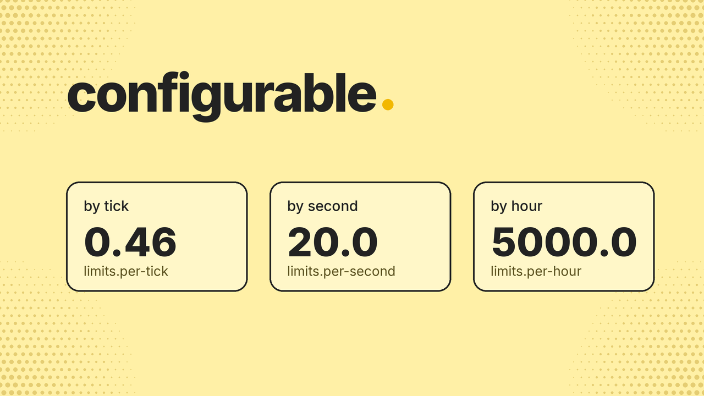
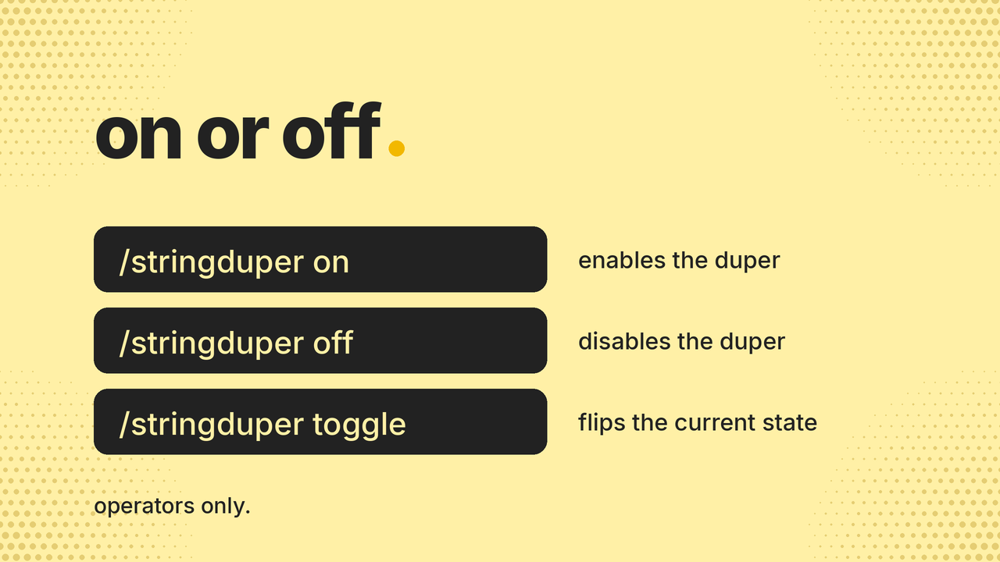

# sdb. (string dupers back.)

## summary

brings string dupers back. configurable by tick, second, and hour, with a simple on/off toggle.

## description


brings string dupers back to minecraft.

### features

- configurable limits: set the duper rate per tick, per second, and per hour
- toggle: on or off, in game or in the config

### usage

1. drop the jar into your `plugins` folder
2. start the server to generate `config.yml`
3. adjust the limits to your liking
4. toggle it with `/stringduper <on|off|toggle>`

### commands

| command | description |
| --- | --- |
| `/stringduper on` | enables the duper |
| `/stringduper off` | disables the duper |
| `/stringduper toggle` | flips the current state |

operators only.

### configuration

```yaml
enabled: true
debug: false

modules:
  max-active: 4

limits:
  per-tick: 0.46
  per-second: 20.0
  per-hour: 5000.0
```

limits are global, shared across the whole server. Set `debug: true` to log water flows targeting tripwire and their validation/rate-limit results.

### compatibility

- bukkit plugin, built for paper and other bukkit-based servers
- api version 26.2




